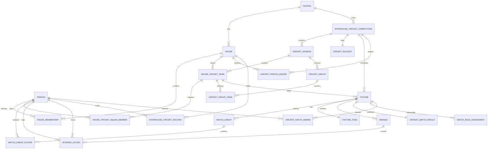

# SCRBRD — Inter-House Cricket Schema

## 1. Purpose

For cricket, SCRBRD should expand the generic Inter-House architecture into a dedicated **Inter-House Cricket competition domain**, while continuing to use the existing SCRBRD cricket scoring engine.

The hierarchy should be:

```text
School
└── Houses
    └── Inter-House Cricket Competition
        ├── Competition Rules
        ├── Divisions / Classes
        ├── House Cricket Teams
        │   ├── Squads
        │   ├── Captains
        │   └── Playing XIs
        ├── Pools / Groups
        ├── Fixtures
        │   ├── Toss
        │   ├── Line-ups
        │   ├── Innings
        │   ├── Deliveries
        │   ├── Scorecard
        │   └── Result
        ├── Standings
        ├── Player Statistics
        ├── House Statistics
        ├── Records
        ├── Awards
        └── House Championship Points
```

The key architectural principle is:

```text
INTER-HOUSE CRICKET
        ↓
controls competition structure

FIXTURE + SCORING ENGINE
        ↓
controls the actual cricket match
```

Do **not** create `interhouse_cricket_deliveries`, `interhouse_cricket_scorecards`, etc. Those would duplicate functionality SCRBRD already has.

---

## 2. Inter-House Cricket Competition

Extend the generic `interhouse_competitions` entity with cricket-specific configuration.

```typescript
interhouse_cricket_competitions {
  cricketCompetitionId: UUID PK

  competitionId: UUID FK -> interhouse_competitions.competitionId
  schoolId: UUID FK
  seasonId: UUID FK?

  name: string
  academicYear: integer

  competitionFormat: enum(
    ROUND_ROBIN,
    KNOCKOUT,
    GROUP_AND_KNOCKOUT,
    LEAGUE,
    LADDER,
    FESTIVAL
  )

  cricketFormat: enum(
    PAIRS,
    MINI_CRICKET,
    T5,
    T10,
    T12,
    T15,
    T20,
    T25,
    T30,
    T40,
    T50,
    TIMED,
    DECLARATION,
    CUSTOM
  )

  ballType: enum(
    HARD_BALL,
    SOFT_BALL,
    INCREDIBALL,
    TENNIS_BALL,
    CUSTOM
  )

  genderCategory: enum(
    BOYS,
    GIRLS,
    MIXED,
    OPEN
  )

  startDate: date
  endDate: date

  status: enum(
    DRAFT,
    REGISTRATION,
    DRAW_PUBLISHED,
    ACTIVE,
    COMPLETED,
    CANCELLED,
    ARCHIVED
  )

  rulesetId: UUID FK

  createdBy: UUID FK
  createdAt: timestamp
  updatedAt: timestamp
}
```

---

## 3. Cricket Ruleset

School inter-house cricket often uses local playing conditions, so rules need to be explicit and configurable.

```typescript
interhouse_cricket_rulesets {
  rulesetId: UUID PK

  schoolId: UUID FK

  name: string
  version: string

  inningsPerSide: integer = 1
  oversPerInnings: integer?

  ballsPerOver: integer = 6

  maxPlayersPerSquad: integer
  playersPerSide: integer = 11

  minimumPlayersToStart: integer?

  maxOversPerBowler: integer?

  powerplayEnabled: boolean
  powerplayOvers: integer?

  fieldingRestrictionsEnabled: boolean

  retirementEnabled: boolean
  retirementRuns: integer?
  retirementBalls: integer?
  battersCanReturnAfterRetirement: boolean
  compulsoryRetirement: boolean

  batterBallLimitEnabled: boolean
  maxBallsPerBatter: integer?

  freeHitEnabled: boolean

  noBallRuns: integer
  wideRuns: integer

  noBallCountsAsBall: boolean = false
  wideCountsAsBall: boolean = false

  lastBatterContinues: boolean = false

  allowSubstitutions: boolean
  concussionReplacementEnabled: boolean

  superOverEnabled: boolean

  tiedMatchRule: enum(
    TIE_ALLOWED,
    SUPER_OVER,
    WICKETS_LOST,
    BOUNDARY_COUNT,
    HEAD_TO_HEAD,
    CUSTOM
  )

  rainRule: enum(
    DLS,
    RUN_RATE,
    REVISED_TARGET,
    SHARE_POINTS,
    REPLAY,
    CUSTOM
  )

  minimumOversForResult: integer?

  pointsSystemId: UUID FK

  customRules: json?

  effectiveFrom: date
  effectiveTo: date?

  active: boolean
}
```

Rules that determine scoring validity should remain structured fields rather than being placed entirely inside JSON.

---

## 4. Divisions / Classes

A single inter-house competition may contain several cricket divisions.

For a South African high-school implementation:

```text
U14
U15
U16
Open
```

Junior schools could instead use:

```text
U9
U10
U11
U12
U13
Open
```

Schema:

```typescript
interhouse_cricket_divisions {
  divisionId: UUID PK

  cricketCompetitionId: UUID FK

  name: string
  code: string

  divisionType: enum(
    AGE_GROUP,
    GRADE,
    JUNIOR,
    SENIOR,
    OPEN,
    CUSTOM
  )

  minimumAge: integer?
  maximumAge: integer?

  minimumGrade: integer?
  maximumGrade: integer?

  playerEligibilityRuleId: UUID?

  formatOverride: enum(
    PAIRS,
    T10,
    T15,
    T20,
    T25,
    T30,
    CUSTOM
  )?

  rulesetOverrideId: UUID?

  displayOrder: integer

  status: enum(
    ACTIVE,
    COMPLETED
  )
}
```

This allows, for example:

```text
U14      T10
U15      T15
U16      T20
Open     T20
```

within the same overall Inter-House Cricket Championship.

---

## 5. House Cricket Teams

A house can enter one team per division, or multiple teams where permitted.

```typescript
house_cricket_teams {
  houseTeamId: UUID PK

  houseId: UUID FK
  cricketCompetitionId: UUID FK
  divisionId: UUID FK

  name: string
  shortName: string?

  teamNumber: integer = 1

  captainId: UUID FK?
  viceCaptainId: UUID FK?

  coachId: UUID FK?
  managerId: UUID FK?

  status: enum(
    DRAFT,
    REGISTERED,
    ACTIVE,
    ELIMINATED,
    WITHDRAWN,
    COMPLETED
  )

  registeredAt: timestamp?
}
```

Examples:

```text
Churchill Open XI
Cliff U15 XI
Windsor U14 A
Pembroke U14 B
```

---

## 6. Squad Registration

A competition squad and a match XI should be separate concepts.

```typescript
house_cricket_squad_members {
  squadMemberId: UUID PK

  houseTeamId: UUID FK
  personId: UUID FK

  primaryRole: enum(
    BATTER,
    WICKETKEEPER_BATTER,
    ALL_ROUNDER,
    BOWLING_ALL_ROUNDER,
    BOWLER,
    WICKETKEEPER
  )?

  battingStyle: enum(
    RIGHT_HAND,
    LEFT_HAND
  )?

  bowlingStyle: enum(
    RIGHT_ARM_FAST,
    RIGHT_ARM_FAST_MEDIUM,
    RIGHT_ARM_MEDIUM,
    LEFT_ARM_FAST,
    LEFT_ARM_FAST_MEDIUM,
    LEFT_ARM_MEDIUM,
    RIGHT_ARM_OFF_SPIN,
    RIGHT_ARM_LEG_SPIN,
    LEFT_ARM_ORTHODOX,
    LEFT_ARM_WRIST_SPIN,
    OTHER
  )?

  wicketkeeperEligible: boolean

  isCaptain: boolean
  isViceCaptain: boolean

  status: enum(
    REGISTERED,
    AVAILABLE,
    UNAVAILABLE,
    INJURED,
    SUSPENDED,
    WITHDRAWN
  )

  registeredAt: timestamp
}
```

---

## 7. Player Eligibility

Inter-house competition creates eligibility questions that normal school-team cricket does not.

Examples:

- Does the pupil belong to that house?
- Are they in the correct age group?
- Can an Open player play U16?
- Can an U15 player play Open?
- Can a pupil play for two house teams on the same day?
- Are first-team school cricketers permitted?
- Is there a quota on representative players?

Schema:

```typescript
interhouse_cricket_eligibility_rules {
  ruleId: UUID PK

  cricketCompetitionId: UUID FK
  divisionId: UUID FK?

  requireActiveHouseMembership: boolean = true

  minimumAge: integer?
  maximumAge: integer?

  minimumGrade: integer?
  maximumGrade: integer?

  allowPlayingUp: boolean
  maximumPlayUpLevels: integer?

  allowPlayingDown: boolean = false

  allowMultipleDivisionParticipation: boolean

  maxMatchesPerDay: integer?

  schoolFirstTeamEligible: boolean
  provincialPlayersEligible: boolean
  nationalPlayersEligible: boolean

  representativePlayerLimitPerXI: integer?

  customConditions: json?
}
```

SCRBRD should validate eligibility before a player can be submitted on a team sheet.

---

## 8. Pools / Groups

```typescript
interhouse_cricket_groups {
  groupId: UUID PK

  cricketCompetitionId: UUID FK
  divisionId: UUID FK

  name: string

  groupType: enum(
    POOL,
    GROUP,
    LEAGUE
  )

  qualificationCount: integer?

  displayOrder: integer
}
```

### Group teams

```typescript
interhouse_cricket_group_teams {
  id: UUID PK

  groupId: UUID FK
  houseTeamId: UUID FK

  seed: integer?
}
```

---

## 9. Knockout Brackets

```typescript
interhouse_cricket_rounds {
  roundId: UUID PK

  cricketCompetitionId: UUID FK
  divisionId: UUID FK

  roundType: enum(
    POOL,
    LEAGUE,
    ROUND_OF_16,
    QUARTER_FINAL,
    SEMI_FINAL,
    PLATE_SEMI_FINAL,
    PLATE_FINAL,
    FINAL,
    THIRD_PLACE
  )

  sequence: integer

  name: string
}
```

---

## 10. Fixtures

Use the existing SCRBRD fixture model.

```typescript
fixtures {
  fixtureId: UUID PK

  ...

  fixtureContext: enum(
    INTER_SCHOOL,
    INTER_HOUSE,
    CLUB,
    PROVINCIAL,
    NATIONAL
  )

  cricketCompetitionId: UUID?
  cricketDivisionId: UUID?
  cricketRoundId: UUID?
  groupId: UUID?

  houseTeamAId: UUID?
  houseTeamBId: UUID?

  fixtureNumber: string?

  scheduledOvers: integer?

  scheduledStart: timestamp
  scheduledEnd: timestamp?

  status: enum(
    SCHEDULED,
    TEAM_SHEETS_PENDING,
    TOSS_PENDING,
    READY,
    LIVE,
    INNINGS_BREAK,
    DELAYED,
    ABANDONED,
    COMPLETED,
    CANCELLED
  )
}
```

The underlying cricket match remains a normal SCRBRD `fixture`.

---

## 11. Match Team Sheets

Competition squad ≠ playing XI.

```typescript
match_lineups {
  lineupId: UUID PK

  fixtureId: UUID FK
  houseTeamId: UUID FK

  captainId: UUID FK
  wicketkeeperId: UUID FK?

  submittedBy: UUID FK
  submittedAt: timestamp

  confirmedAt: timestamp?

  status: enum(
    DRAFT,
    SUBMITTED,
    VERIFIED,
    LOCKED
  )
}
```

### Players

```typescript
match_lineup_players {
  lineupPlayerId: UUID PK

  lineupId: UUID FK
  personId: UUID FK

  battingPosition: integer?

  playingStatus: enum(
    PLAYING_XI,
    SUBSTITUTE,
    RESERVE
  )

  isCaptain: boolean
  isWicketkeeper: boolean

  eligibilityStatus: enum(
    VALID,
    WARNING,
    INELIGIBLE,
    OVERRIDDEN
  )

  eligibilityOverrideBy: UUID?
  eligibilityOverrideReason: string?
}
```

Once the match begins, the submitted XI should become immutable except through a controlled substitution workflow.

---

## 12. Toss

```typescript
fixture_toss {
  fixtureId: UUID PK

  winningHouseTeamId: UUID FK

  tossChoice: enum(
    BAT,
    BOWL
  )

  conductedBy: UUID FK?
  recordedBy: UUID FK

  recordedAt: timestamp
}
```

SCRBRD should infer the batting order from the toss result rather than store redundant values.

---

## 13. Match Officials

```typescript
match_role_assignments {
  assignmentId: UUID PK

  fixtureId: UUID FK
  personId: UUID FK

  role: enum(
    UMPIRE,
    SCORER,
    ASSISTANT_SCORER,
    MATCH_REFEREE,
    TEACHER_IN_CHARGE,
    GROUND_MANAGER,
    LIVESTREAM_OPERATOR
  )

  confirmedAt: timestamp?

  status: enum(
    ASSIGNED,
    CONFIRMED,
    COMPLETED,
    WITHDRAWN
  )
}
```

---

## 14. Innings

The scorecard should remain a projection derived from delivery events.

```typescript
innings {
  inningsId: UUID PK

  fixtureId: UUID FK

  inningsNumber: integer

  battingTeamId: UUID FK
  bowlingTeamId: UUID FK

  targetRuns: integer?
  targetOvers: decimal?

  status: enum(
    NOT_STARTED,
    LIVE,
    DECLARED,
    ALL_OUT,
    TARGET_REACHED,
    OVERS_COMPLETE,
    FORFEITED,
    COMPLETED
  )

  startedAt: timestamp?
  completedAt: timestamp?
}
```

---

## 15. Delivery-Level Scoring

This remains the foundation of SCRBRD cricket.

```typescript
scoring_actions {
  scoringActionId: UUID PK

  fixtureId: UUID FK
  inningsId: UUID FK

  eventSequence: bigint

  overNumber: integer
  ballInOver: integer

  strikerId: UUID FK
  nonStrikerId: UUID FK
  bowlerId: UUID FK

  runsOffBat: integer

  extrasType: enum(
    NONE,
    WIDE,
    NO_BALL,
    BYE,
    LEG_BYE,
    PENALTY
  )

  extrasRuns: integer

  isLegalDelivery: boolean

  wicketOccurred: boolean

  dismissalType: enum(
    BOWLED,
    CAUGHT,
    LBW,
    RUN_OUT,
    STUMPED,
    HIT_WICKET,
    RETIRED_OUT,
    OBSTRUCTING_FIELD,
    HIT_BALL_TWICE,
    TIMED_OUT
  )?

  dismissedPlayerId: UUID?
  fielderId: UUID?
  secondaryFielderId: UUID?

  shotType: string?
  wagonWheelSegment: integer?
  wagonWheelZone: string?
  shotIntent: string?

  freeHit: boolean

  timestamp: timestamp

  scorerId: UUID FK

  idempotencyKey: string

  supersedesActionId: UUID?
}
```

These events should remain **append-only with deterministic replay**, rather than allowing direct score editing.

---

## 16. Three-Phase Scoring Integration

Inter-House cricket should use the same SCRBRD three-phase scoring model.

```text
PHASE 1 — DELIVERY CONTEXT
Bowler
Batter
Field
Delivery / approach information

        ↓

PHASE 2 — SCORE
0 / 1 / 2 / 3 / 4 / 6
Wide
No-ball
Bye
Leg bye
Wicket

        ↓

PHASE 3 — ENRICHMENT
Shot type
Wagon-wheel location
Fielding outcome
Dismissal detail
Additional analytical attributes
```

Inter-house cricket therefore contributes to the same player intelligence dataset as normal school cricket.

Example:

```text
ALL CRICKET

School Cricket
12 matches
421 runs
17 wickets

Inter-House Cricket
6 matches
212 runs
8 wickets

Combined
18 matches
633 runs
25 wickets
```

---

## 17. Match Result

```typescript
cricket_match_results {
  resultId: UUID PK

  fixtureId: UUID FK

  resultType: enum(
    WIN,
    TIE,
    DRAW,
    NO_RESULT,
    ABANDONED,
    WALKOVER,
    FORFEIT
  )

  winningTeamId: UUID?
  losingTeamId: UUID?

  winByType: enum(
    RUNS,
    WICKETS,
    INNINGS,
    DLS,
    WALKOVER,
    FORFEIT
  )?

  winMargin: integer?

  resultText: string

  firstInningsTeamScore: string?
  secondInningsTeamScore: string?

  dlsApplied: boolean

  verifiedBy: UUID FK?
  verifiedAt: timestamp?

  status: enum(
    PROVISIONAL,
    OFFICIAL,
    DISPUTED,
    OVERTURNED
  )
}
```

Example:

```text
Churchill House 147/6
Cliff House 139/8

Churchill won by 8 runs
```

---

## 18. League Points

Cricket competition points must remain separate from overall House Championship points.

Example:

```text
CRICKET LEAGUE POINTS

Win             4
Tie             2
No Result       2
Loss            0
Bonus Point     1
```

Schema:

```typescript
interhouse_cricket_points_systems {
  pointsSystemId: UUID PK

  cricketCompetitionId: UUID FK

  winPoints: decimal
  tiePoints: decimal
  drawPoints: decimal
  noResultPoints: decimal
  lossPoints: decimal
  walkoverWinPoints: decimal

  bonusPointsEnabled: boolean

  battingBonusRules: json?
  bowlingBonusRules: json?

  penaltyRules: json?
}
```

---

## 19. Match Points Transactions

Use a ledger rather than overwriting totals.

```typescript
interhouse_cricket_points_ledger {
  transactionId: UUID PK

  cricketCompetitionId: UUID FK
  fixtureId: UUID FK?

  houseTeamId: UUID FK
  houseId: UUID FK

  type: enum(
    WIN,
    TIE,
    DRAW,
    NO_RESULT,
    BATTING_BONUS,
    BOWLING_BONUS,
    WALKOVER,
    PENALTY,
    ADJUSTMENT
  )

  points: decimal

  description: string

  awardedBy: UUID FK?
  createdAt: timestamp

  reversalOf: UUID?
}
```

---

## 20. Cricket Standings

Generated from fixtures and the points ledger.

```typescript
interhouse_cricket_standings {
  cricketCompetitionId
  divisionId
  groupId?
  houseTeamId
  houseId

  played
  won
  lost
  tied
  drawn
  noResults

  runsFor
  oversFaced

  runsAgainst
  oversBowled

  points

  bonusPoints
  penaltyPoints

  netRunRate

  position
  previousPosition

  qualified: boolean
}
```

---

## 21. Net Run Rate

NRR should be calculated centrally rather than stored manually.

Conceptually:

```text
NRR =

Total runs scored
──────────────────
Total overs faced

MINUS

Total runs conceded
────────────────────
Total overs bowled
```

SCRBRD needs proper handling for:

- all-out innings;
- shortened innings;
- revised targets;
- DLS;
- incomplete matches;
- forfeits;
- competition-specific rules.

Do not calculate NRR naïvely from decimal overs.

`17.4 overs` means:

```text
17 overs + 4 balls
= 106 legal deliveries
```

not `17.4 × 6`.

SCRBRD should store **legal balls** internally and format them as overs for presentation.

---

## 22. Player Match Performance

Most of this should be generated from deliveries.

```typescript
player_match_cricket_stats {
  fixtureId
  personId
  houseId
  houseTeamId

  // Batting
  battingPosition

  runs
  ballsFaced
  fours
  sixes
  dotsFaced

  strikeRate

  dismissalType
  dismissedById
  fielderId

  // Bowling
  ballsBowled
  maidens
  runsConceded
  wickets

  wides
  noBalls

  economyRate

  // Fielding
  catches
  stumpings
  runOuts
}
```

This should be a **projection/read model**, not manually entered data wherever delivery events exist.

---

## 23. Competition Player Statistics

```typescript
interhouse_cricket_player_stats {
  cricketCompetitionId
  divisionId?
  personId
  houseId

  matches
  innings

  runs
  highestScore

  battingAverage
  strikeRate

  hundreds
  fifties

  fours
  sixes

  notOuts
  ballsFaced

  wickets

  bowlingAverage
  bowlingStrikeRate
  economyRate

  bestBowlingRuns
  bestBowlingWickets

  fiveWicketHauls

  maidens

  catches
  stumpings
  runOuts

  playerOfMatchAwards
}
```

---

## 24. House Cricket Statistics

```typescript
interhouse_cricket_house_stats {
  cricketCompetitionId
  houseId

  played
  won
  lost
  tied
  noResults

  runsScored
  runsConceded

  wicketsTaken
  wicketsLost

  fours
  sixes

  highestTeamScore
  lowestTeamScore

  highestSuccessfulChase

  largestWinByRuns
  largestWinByWickets

  netRunRate

  championshipWins
}
```

---

## 25. House vs House Head-to-Head

```typescript
interhouse_cricket_h2h {
  h2hId: UUID PK

  schoolId: UUID FK

  houseAId: UUID FK
  houseBId: UUID FK

  divisionId: UUID?

  matchesPlayed: integer

  houseAWins: integer
  houseBWins: integer

  ties: integer
  noResults: integer

  houseARuns: integer
  houseBRuns: integer

  lastMeetingFixtureId: UUID FK?

  updatedAt: timestamp
}
```

Example spectator UI:

```text
CHURCHILL vs CLIFF

Played        18
Churchill      9
Cliff          7
Tied           1
No Result      1

Last 5
CHU  W W L W L
CLF  L L W L W
```

---

## 26. Batter vs Bowler H2H

Reuse the existing SCRBRD player H2H model.

```typescript
player_h2h_stats {
  batsmanId
  bowlerId

  competitionContext

  runsScored
  ballsFaced

  dismissals

  fours
  sixes

  dots

  strikeRate
  dotBallPercentage
  boundaryPercentage
}
```

Example:

```text
K. Naidoo vs S. Mthembu

28 runs
19 balls
147.4 SR
2 dismissals
```

---

## 27. Cricket Records

```typescript
interhouse_cricket_records {
  recordId: UUID PK

  schoolId: UUID FK
  cricketCompetitionId: UUID?

  divisionId: UUID?

  recordType: enum(
    MOST_RUNS_MATCH,
    MOST_RUNS_SEASON,
    HIGHEST_SCORE,
    MOST_WICKETS_MATCH,
    MOST_WICKETS_SEASON,
    BEST_BOWLING,
    BEST_ECONOMY,
    HIGHEST_PARTNERSHIP,
    HIGHEST_TEAM_SCORE,
    LOWEST_TEAM_SCORE,
    FASTEST_FIFTY,
    FASTEST_HUNDRED,
    MOST_SIXES,
    MOST_CATCHES,
    HAT_TRICK,
    OTHER
  )

  holderType: enum(
    PLAYER,
    HOUSE,
    PARTNERSHIP
  )

  personId: UUID?
  secondPersonId: UUID?
  houseId: UUID?

  value: decimal

  fixtureId: UUID FK

  achievedOn: date

  previousRecordId: UUID?

  status: enum(
    ACTIVE,
    SUPERSEDED,
    INVALIDATED
  )
}
```

---

## 28. Partnerships

```typescript
innings_partnerships {
  partnershipId: UUID PK

  inningsId: UUID FK

  wicketNumber: integer

  batter1Id: UUID FK
  batter2Id: UUID FK

  runs: integer
  balls: integer

  batter1Runs: integer
  batter2Runs: integer

  unbroken: boolean
}
```

This enables records such as:

> Highest Open Inter-House 3rd-wicket partnership.

---

## 29. Fall of Wickets

Generated from scoring events:

```typescript
fall_of_wickets {
  inningsId
  wicketNumber

  teamRuns
  legalBallNumber

  dismissedPlayerId

  overDisplay

  partnershipRuns
}
```

Example:

```text
1-32 (Patel, 4.2)
2-57 (Naidoo, 7.6)
3-101 (Mthembu, 14.1)
```

---

## 30. Wagon Wheel + Shot Intelligence

```typescript
delivery_shot_data {
  scoringActionId: UUID PK

  shotType: enum(
    DEFENCE,
    DRIVE,
    CUT,
    PULL,
    HOOK,
    SWEEP,
    REVERSE_SWEEP,
    GLANCE,
    FLICK,
    LOFTED_DRIVE,
    SCOOP,
    OTHER
  )

  wagonWheelAngle: decimal?
  wagonWheelDistance: decimal?

  wagonWheelSegment: integer?

  zone: enum(
    THIRD_MAN,
    POINT,
    COVER,
    MID_OFF,
    STRAIGHT,
    MID_ON,
    MID_WICKET,
    SQUARE_LEG,
    FINE_LEG
  )?

  aerial: boolean?

  intent: enum(
    DEFENSIVE,
    ROTATE_STRIKE,
    ATTACKING,
    BOUNDARY
  )?
}
```

Inter-house matches should contribute to the same analytical dataset as school fixtures.

---

## 31. Field Placements

```typescript
delivery_field_state {
  fieldStateId: UUID PK

  fixtureId: UUID FK
  inningsId: UUID FK

  effectiveFromSequence: bigint

  bowlerId: UUID FK
  strikerId: UUID FK

  fielders: json
}
```

This can later integrate directly with the Coach/Captain Cockpit and opposition-analysis systems.

---

## 32. Player of the Match

```typescript
cricket_match_awards {
  awardId: UUID PK

  fixtureId: UUID FK
  personId: UUID FK

  awardType: enum(
    PLAYER_OF_MATCH,
    BEST_BATTER,
    BEST_BOWLER,
    BEST_FIELDER,
    MVP
  )

  reason: string?

  selectedBy: UUID FK?

  createdAt: timestamp
}
```

These can feed the existing SCRBRD `awards` system.

---

## 33. Tournament Awards

Examples:

```text
Player of the Tournament
Leading Run Scorer
Leading Wicket Taker
Best Fielder
Best Wicketkeeper
Most Valuable Player
Best Junior Player
Spirit of Cricket Award
Champion House
Runner-Up
```

Schema:

```typescript
interhouse_cricket_awards {
  awardId: UUID PK

  cricketCompetitionId: UUID FK

  awardType: string

  recipientType: enum(
    PERSON,
    HOUSE,
    TEAM
  )

  personId: UUID?
  houseId: UUID?
  houseTeamId: UUID?

  value: decimal?
  description: string?

  awardedAt: timestamp
}
```

---

## 34. Disciplinary / Match Incidents

Inter-house cricket should plug into SCRBRD disciplinary data rather than create an isolated system.

```typescript
disciplinary_incidents {
  ...

  competitionContext: enum(
    SCHOOL,
    INTER_HOUSE,
    INTER_SCHOOL
  )

  cricketCompetitionId: UUID?
}
```

Possible incidents:

```text
Slow over rate
Player eligibility breach
Abusive behaviour
Dissent
Equipment infringement
Dangerous bowling
Pitch invasion
Team sheet irregularity
Late arrival
Forfeit
```

---

## 35. Protests and Appeals

Competition disputes are not necessarily disciplinary incidents.

```typescript
interhouse_cricket_protests {
  protestId: UUID PK

  fixtureId: UUID FK

  submittedByHouseId: UUID FK
  againstHouseId: UUID FK?

  protestType: enum(
    PLAYER_ELIGIBILITY,
    SCORING_ERROR,
    UMPIRE_DECISION,
    PLAYING_CONDITIONS,
    RESULT,
    FIXTURE_RULE,
    OTHER
  )

  description: string

  submittedBy: UUID FK
  submittedAt: timestamp

  status: enum(
    SUBMITTED,
    UNDER_REVIEW,
    UPHELD,
    DISMISSED,
    WITHDRAWN
  )

  resolution: string?
  resolvedBy: UUID FK?
  resolvedAt: timestamp?
}
```

SCRBRD should distinguish between competition administration disputes and ordinary umpiring judgement.

---

## 36. Overall House Championship Contribution

Cricket league points and House Cup points are separate systems.

Example:

```text
OPEN CRICKET FINAL

Churchill wins championship.
```

Within cricket:

```text
Churchill
League = 16 points
```

But towards the annual House Cup:

```text
1st Churchill    = 50 House Cup points
2nd Cliff        = 40
3rd Windsor      = 30
4th Pembroke     = 20
```

Schema:

```typescript
house_championship_points {
  transactionId: UUID PK

  championshipId: UUID FK

  competitionId: UUID FK
  cricketCompetitionId: UUID?

  houseId: UUID FK

  sourceType: enum(
    CRICKET_FINAL_PLACING,
    CRICKET_DIVISION_PLACING,
    PARTICIPATION,
    BONUS,
    PENALTY
  )

  points: decimal

  description: string

  createdAt: timestamp
}
```

---

## 37. Multiple Cricket Divisions Feeding One House Result

Example:

```text
INTER-HOUSE CRICKET

U14 Championship
1st Churchill    10
2nd Cliff         8
3rd Windsor       6
4th Pembroke      4

U15 Championship
...

U16 Championship
...

Open Championship
...
```

Combined:

```text
HOUSE             U14  U15  U16  OPEN    TOTAL

Churchill           10    8    6    10      34
Cliff                 8   10    8     8      34
Windsor               6    6   10     6      28
Pembroke              4    4    4     4      16
```

Recommended model:

```typescript
interhouse_cricket_division_results {
  cricketCompetitionId
  divisionId
  houseId

  finalPosition
  championshipPoints
}
```

Then aggregate dynamically.

---

## 38. Participation Analytics

SCRBRD can report:

```text
CHURCHILL HOUSE CRICKET

72 pupils represented the house
38% of eligible boys participated
19 first-time competitive cricketers
4 teams entered
12 matches played

Participation YoY
2024    51
2025    63
2026    72 ↑14%
```

Schema:

```typescript
interhouse_cricket_participation_stats {
  academicYear
  cricketCompetitionId
  houseId

  eligiblePupils
  registeredPlayers
  playersWhoPlayed

  firstTimePlayers

  matchesPlayed

  participationRate
}
```

---

## 39. Live Match Centre

The same schema powers a spectator Match Centre.

```text
┌────────────────────────────────────────────┐
│ INTER-HOUSE CRICKET • OPEN FINAL          │
│                                            │
│ CHURCHILL             CLIFF                │
│                                            │
│ 134/5                 Target 135           │
│ 18.2 OVERS                                 │
│                                            │
│ CLIFF 97/4                                 │
│ 14.1 OVERS                                 │
│                                            │
│ Need 38 from 35                            │
│ Required RR 6.51                           │
├────────────────────────────────────────────┤
│ Naidoo        38* (29)                     │
│ Patel         12* (8)                      │
│                                            │
│ Singh         2/21 (3.1)                   │
├────────────────────────────────────────────┤
│ Last 6:  1  •  4  1  W  2  •              │
├────────────────────────────────────────────┤
│ Win probability                            │
│ Cliff 58%   Churchill 42%                  │
├────────────────────────────────────────────┤
│ Wagon Wheel │ Partnerships │ Scorecard     │
└────────────────────────────────────────────┘
```

---

## 40. House Cricket Dashboard

Each house gets a cricket dashboard.

```text
CHURCHILL HOUSE
INTER-HOUSE CRICKET 2026

Overall position       1st
Competition points     42
Net run rate           +1.84

OPEN          1st
U16           3rd
U15           2nd
U14           1st

MATCHES
P 14   W 10   L 3   T 0   NR 1

TOP RUN SCORER
K. Naidoo
286 runs • 57.20 avg

TOP WICKET TAKER
S. Mthembu
17 wickets • 9.41 avg

HOUSE RECORDS
3 broken this year

NEXT MATCH
U16 Semi-Final
Churchill v Cliff
Thursday • 14:30
```

---

## 41. Player Profile Integration

A player should not get a separate “inter-house profile”.

Instead their existing cricket profile gains competition filters.

```text
KAMEEL PATEL
Cricket Profile

FILTER
All Cricket
School 1st XI
School U16
Inter-House
Provincial
Club
```

Performance history can show:

```text
2026

SCHOOL CRICKET
14 matches
492 runs
31 wickets

INTER-HOUSE
5 matches
201 runs
7 wickets

CLUB
8 matches
317 runs
14 wickets
```

The same skills matrices, wagon wheels and H2H analytics remain available.

---

## 42. Historical House Cricket

Once SCRBRD has several years of data:

```text
CHURCHILL vs CLIFF
OPEN INTER-HOUSE CRICKET

Since 2006

Played                 31
Churchill               17
Cliff                   12
Ties                      1
No Result                 1

Highest Score
Churchill 218/4 — 2022

Lowest Score
Cliff 47 — 2011

Biggest Win
Churchill — 91 runs — 2018

Highest Individual Score
K. Patel — 126* — 2025

Best Bowling
S. Singh — 6/17 — 2019
```

This gives SCRBRD long-term historical value beyond live scoring.

---

## 43. Inter-House Cricket ER Model



---

## 44. Recommended Top-Level Database Structure

```text
CORE
├── schools
├── persons
├── houses
├── house_memberships
└── house_role_assignments


INTER-HOUSE
├── interhouse_competitions
├── interhouse_competition_houses
├── house_championships
└── house_championship_points


INTER-HOUSE CRICKET
├── interhouse_cricket_competitions
├── interhouse_cricket_rulesets
├── interhouse_cricket_divisions
├── interhouse_cricket_eligibility_rules
├── house_cricket_teams
├── house_cricket_squad_members
├── interhouse_cricket_groups
├── interhouse_cricket_group_teams
├── interhouse_cricket_rounds
├── interhouse_cricket_points_systems
├── interhouse_cricket_points_ledger
├── interhouse_cricket_division_results
├── interhouse_cricket_records
├── interhouse_cricket_awards
└── interhouse_cricket_protests


MATCH ENGINE
├── fixtures
├── match_lineups
├── match_lineup_players
├── fixture_toss
├── innings
├── scoring_actions
├── ball_events
├── commentary
├── match_role_assignments
└── cricket_match_results


ANALYTICS / READ MODELS
├── scorecards
├── player_match_cricket_stats
├── interhouse_cricket_player_stats
├── interhouse_cricket_house_stats
├── interhouse_cricket_standings
├── interhouse_cricket_h2h
├── player_h2h_stats
├── innings_partnerships
└── fall_of_wickets
```

---

## 45. Strategic Role within SCRBRD

Inter-House Cricket should not be treated as a lighter version of normal cricket simply because it is internal school sport.

It can become one of SCRBRD's richest player-data acquisition layers.

A pupil may progress through:

```text
Grade 8 House Cricket
       ↓
U14 House Cricket
       ↓
U15 House Cricket
       ↓
U16 House Cricket
       ↓
Open House Cricket
       ↓
School Team Selection
```

SCRBRD can therefore begin building that player's cricket history before they ever reach an official school side.

This makes the module part of the wider **Player Journey, talent-identification, Coach Cockpit, scouting and performance-analysis architecture**.

The same dataset can eventually surface:

```text
Emerging players
High-performing non-school-team players
Year-on-year development
House cricket → school cricket progression
Previously overlooked talent
Batting/bowling development curves
Role evolution
Selection readiness
```

The result is not merely an Inter-House Cricket administration feature, but a core developmental and intelligence layer within SCRBRD.
