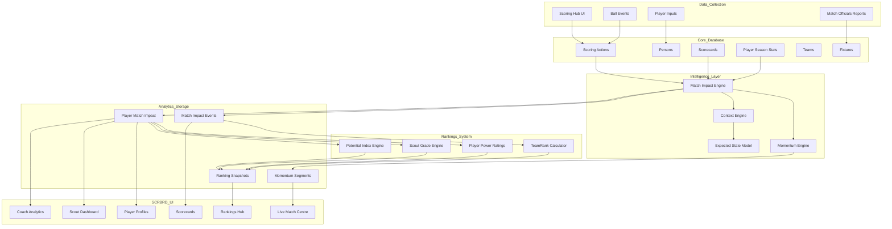
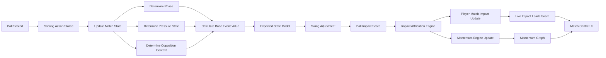
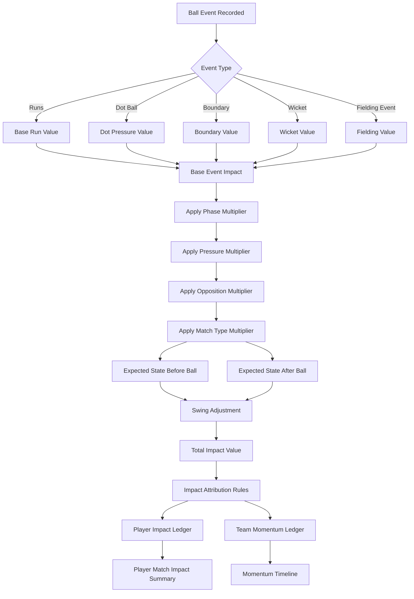
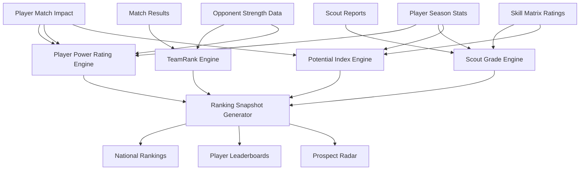

# SCRBRD Engineering Architecture and Flow Model

This document translates the SCRBRD product vision into a concrete engineering architecture and flow model that product, engineering, and investors can read from the same page.

It complements the existing concept docs by defining:

- the major system layers
- the live ball-by-ball processing path
- the Match Impact Engine logic flow
- the rankings intelligence flow
- the frontend module surface

## 1. SCRBRD System Architecture

This is the platform-level view of how raw scoring data becomes intelligence products and user-facing experiences.



### Interpretation

SCRBRD is best understood as four connected layers:

1. Data collection through live scoring and match administration
2. Intelligence processing through impact, momentum, context, and state models
3. Rankings and evaluation systems for teams, players, scouts, and prospects
4. User-facing products for scoring, viewing, selection, development, and discovery

That separation is important because the ranking outputs should depend on derived intelligence, not directly on raw scorecards.

## 2. Live Match Data Pipeline

This shows the per-ball flow required to produce live impact, momentum, and leaderboard updates.



### Engineering implication

The impact engine cannot run in isolation. It depends on live match state first.

The minimum dependency order is:

1. persist the scoring action
2. update the innings and match state
3. derive context
4. calculate event impact
5. attribute impact to participants
6. update player and team aggregates
7. publish live UI updates

## 3. Match Impact Engine Logic Flow

This diagram isolates the decision flow inside the Match Impact Engine.



### Core design rule

Impact should combine two things:

- event value: what happened on the ball
- state change: how much the ball changed the match

This avoids the common mistake of treating all wickets, boundaries, and dot balls as equally meaningful.

## 4. Rankings Intelligence Engine

This shows how match intelligence feeds the broader evaluation system.



### Design consequence

SCRBRD rankings should not be scorecard leaderboards with better branding.

They should be generated from:

- impact data
- match outcomes
- opponent quality
- scout assessments
- skill ratings

That is what makes the system more defensible against stat padding and weak-schedule inflation.

## 5. Frontend Module Map

This is the product surface that sits on top of the architecture.

```mermaid
flowchart TB

A[SCRBRD Platform]

A --> B[Live Scoring Hub]
A --> C[Live Match Centre]
A --> D[Match Scorecard]
A --> E[Rankings Hub]
A --> F[Player Profile]
A --> G[Scout Dashboard]
A --> H[Coach Analytics]

B --> I[Ball Entry]
B --> J[Pitch Map]
B --> K[End of Over Summary]

C --> L[Momentum Graph]
C --> M[Impact Timeline]
C --> N[Top Impact Players]

D --> O[Impact Tab]
D --> P[Decisive Moments]
D --> Q[Player Impact Table]

E --> R[Team Rankings]
E --> S[Player Rankings]
E --> T[Top 100 Lists]

F --> U[Performance Timeline]
F --> V[Skill Radar]
F --> W[Impact History]

G --> X[Prospect Radar]
G --> Y[Scout Reports]
G --> Z[Player Comparisons]

H --> AA[Phase Analysis]
H --> AB[Pressure Metrics]
H --> AC[Execution Reports]
```



## System Design Observations

### 1. The Impact Engine is the platform core

The impact model is the main intelligence layer. Rankings, scouting context, momentum, match narratives, and MVP logic should all depend on it.

### 2. Rankings should be snapshot-based

Rankings should be stored as immutable snapshots rather than overwritten values. That enables:

- historical tables
- trend charts
- movement indicators
- season archives
- model-by-model auditability

### 3. Analytics models need versioning

Impact and ranking outputs should be stored with explicit model versions.

Recommended fields:

```txt
impactModelVersion
rankingModelVersion
```

Without this, recalculations become impossible to explain after model logic changes.

### 4. Live and final impact must be separated

Live calculations should be labelled as provisional.

Recommended labels:

- `Live Impact (Provisional)`
- `Final Impact`

That distinction matters because expected-state and attribution adjustments may change after innings close or after post-match validation.

## Current Codebase Mapping

The target architecture already has partial implementation in the codebase.

### Existing modules

- [`src/services/impact/ImpactEngine.ts`](/Users/kameel.kalyan/Documents/SCRBRD/src/services/impact/ImpactEngine.ts): current ball impact calculation, including base event value, pressure multiplier, and phase detection
- [`src/services/impact/ImpactAttributor.ts`](/Users/kameel.kalyan/Documents/SCRBRD/src/services/impact/ImpactAttributor.ts): current impact attribution across batter, bowler, and fielder roles
- [`src/lib/scoring/scoringHubMachine.ts`](/Users/kameel.kalyan/Documents/SCRBRD/src/lib/scoring/scoringHubMachine.ts): current scoring workflow state machine
- [`src/hooks/useScoringHub.ts`](/Users/kameel.kalyan/Documents/SCRBRD/src/hooks/useScoringHub.ts): scoring hub orchestration hook
- [`src/app/matches/[id]/scoring-hub/page.tsx`](/Users/kameel.kalyan/Documents/SCRBRD/src/app/matches/[id]/scoring-hub/page.tsx): scoring hub route
- [`src/app/match-center/[matchId]/page.tsx`](/Users/kameel.kalyan/Documents/SCRBRD/src/app/match-center/[matchId]/page.tsx): match centre route

### What is implemented now

- base event scoring
- pressure multiplier logic
- simple phase classification
- role-based impact attribution
- scoring workflow state transitions

### What the diagrams define as the next architecture step

- a dedicated context engine
- an expected state model with before/after ball snapshots
- momentum segment storage and rendering
- snapshot-based ranking generation
- model-versioned analytics outputs
- distinct provisional and final impact pipelines

## Recommended Delivery Sequence

1. Stabilize the live scoring event model and match state projection.
2. Extend the impact engine to emit before/after state and swing adjustment data.
3. Persist match impact events and player match impact ledgers.
4. Build momentum segments and live match centre visualizations on top of those ledgers.
5. Add ranking snapshot generation with model version fields.
6. Layer scout grade and potential index logic onto the ranking pipeline.

## Positioning

If this architecture is implemented cleanly, SCRBRD becomes three systems at once:

1. a scoring platform
2. a cricket intelligence engine
3. a talent discovery network

That is the strategic distinction between SCRBRD and standard scorekeeping products.
