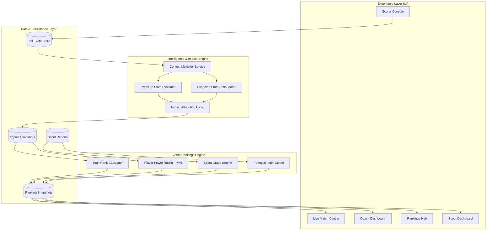
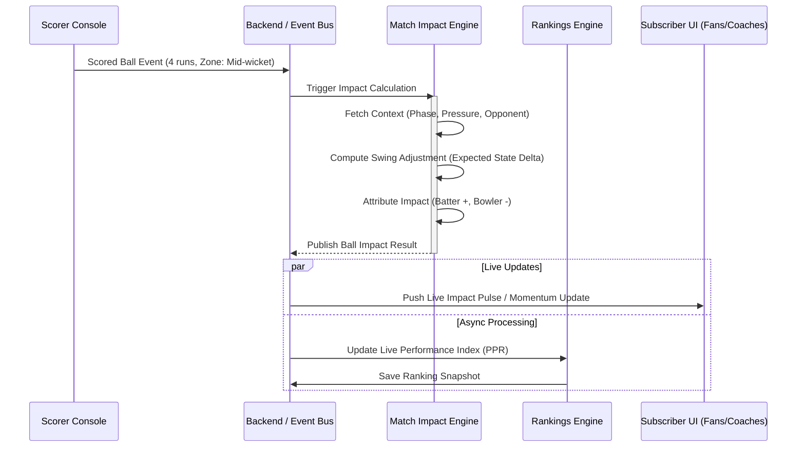
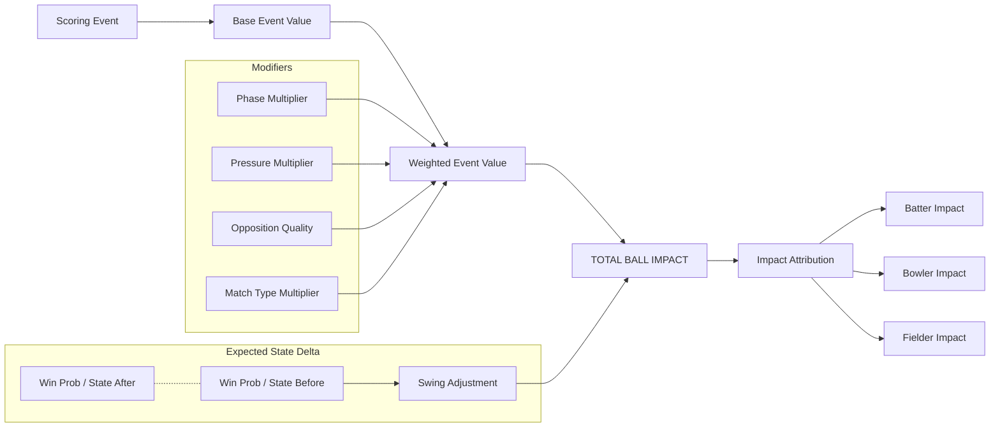
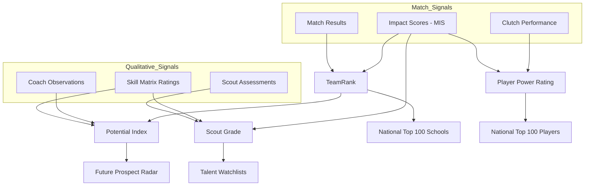
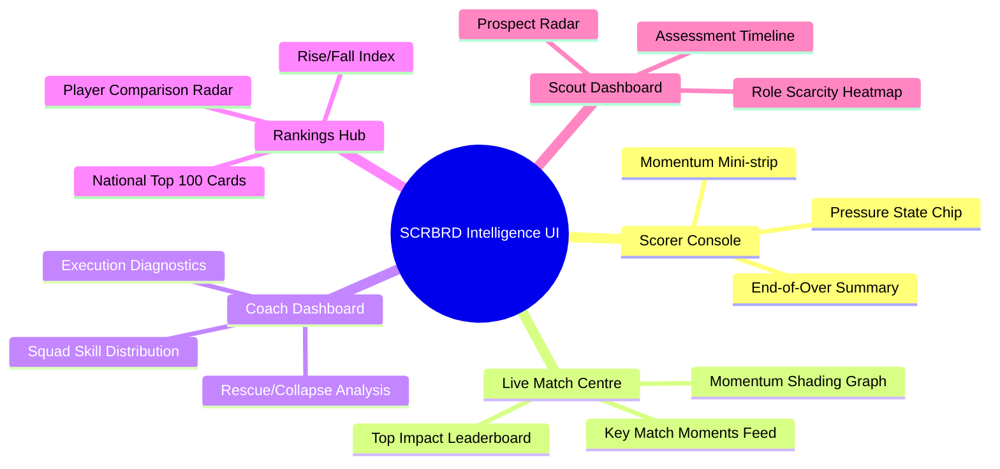

# SCRBRD Rankings & Impact Engine: Architecture Pack

This document contains the core system architecture and logical flow diagrams for the SCRBRD Rankings Intelligence Suite and Match Impact Engine.

---

## 1. SCRBRD System Architecture

This 4-layer architecture ensures clear separation between raw data collection, contextual intelligence, and the ranking ecosystem.

---

## 2. Live Match Data Pipeline

The millisecond-level flow from a scoring action to a global ranking update.

---

## 3. Match Impact Engine Logic Flow

The internal pipeline for evaluating a single ball's consequence.

---

## 4. Rankings Intelligence Engine

How diverse data signals converge into the four definitive SCRBRD scores.

---

## 5. Frontend Module Map

Target UI surfaces for each SCRBRD role.

---

1. **Context Recognition:** We don't just count runs; we measure pressure and consequence.
2. **Attribution Fairness:** Impact is shared between bowlers, fielders, and batters based on multi-actor interaction.
3. **Snapshot Integrity:** Rankings are versioned and verifiable, creating a reliable historical record for every player.
4. **Hybrid Intelligence:** We combine hard ball-data with human scout expertise for a "Moneyball" level of precision.
